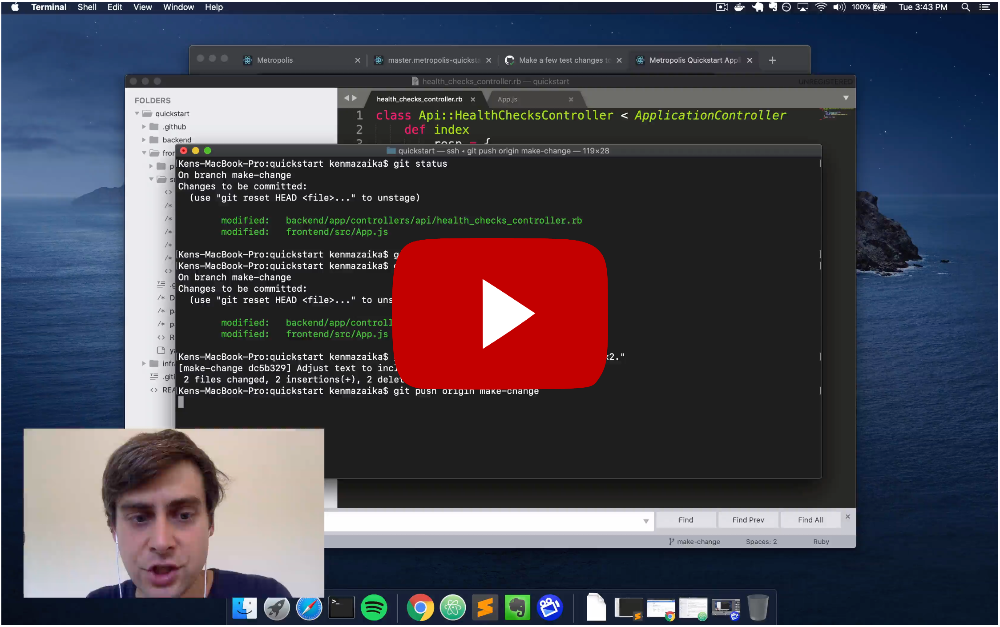

<!--
  Raw video footage, slidedecks, and scripts are uploaded
  in Google Cloud Storage:

  https://console.cloud.google.com/storage/browser/metropolis-videos/documentation/overview
-->

# Metropolis Overview

## Watch

These videos will help you understand what the Metropolis platform does, benefits to this approach and exactly how to provision sandbox environments extremely easily using Metropolis.  Get started by watching this video, and then continue watching the videos down below, to learn more in depth.

## [Next Video: 1 – Metropolis Overview: Quickstart Demo](/overview/1.md)

## Other Resources

* 0 – Metropolis Overview
* **[1 – Metropolis Overview: Quickstart Demo](/overview/1.md)**
* **[2 – Metropolis Overview: Traditional Approach](/overview/2.md)**
* **[3 – Metropolis Overview: Metropolis Approach](/overview/3.md)**
* **[4 – Metropolis Overview: Next Steps](/overview/4.md)**
